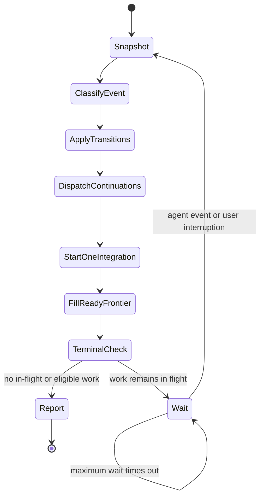

# Orchestration State Machine

This file is the single source of truth for scheduling and transitions. Read it
completely before bootstrap and immediately after every `hub` wait return.

## Cycle inputs

Take a fresh snapshot of all six inputs before deciding what to do:

1. Persisted task-table rows and dependency statuses.
2. Run ledger: assigned agents, task stages, outstanding delegations, and
   accepted evidence.
3. `hub` `list` and `jobs` snapshots: assigned-agent availability and newly
   returned results.
4. The event that ended the wait: agent result, question, blocker, timeout, or
   user interruption.
5. Available concurrency capacity.
6. Durable Git evidence: branches, commits, worktrees, review artifacts, and
   remote phase-branch state.

Never infer a transition from a message alone when the transition requires
durable evidence.

## Orchestrator cycle



Execute every box in order after an event. Do not jump directly from an agent
result to waiting.

### Snapshot

Refresh all cycle inputs. Drain every available agent update so one wake-up
handles the complete current mailbox rather than only its first message.

### Classify event

- Agent result: associate it with exactly one task, assigned agent, and
  outstanding stage.
- Agent question or blocker: answer only the orchestration decision it requires;
  preserve the task stage.
- Wait timeout: preserve every state and proceed through the rest of the cycle.
- User cancellation: stop the affected agents and report the preserved state.
- Other user interruption: incorporate the instruction or answer, then continue
  the cycle.

### Apply transitions

Accept a claimed result only when the stage's completion criterion and durable
evidence agree. Apply every accepted transition in integer task-ID order. Record
rejected evidence without advancing the task.

### Dispatch continuations

Send every repair, review, publication, or requested-evidence continuation made
ready by the accepted transitions. Use the assigned agent from the ledger.

### Start one integration

When no integration or publication is active, start the lowest-ID task in
`QUEUED_INTEGRATION`. Keep all other approved tasks queued.

### Fill ready frontier

Recompute `READY` tasks from the persisted table. Dispatch preparation for as
many lowest-ID ready tasks as capacity permits in the same scheduling pass.

### Terminal check

- If delegations are in flight, call `hub` with `op: "wait"` and
  `timeoutMs: 3600000` once.
- If work exists but only unmet dependencies block it, report each blocked task
  and dependency.
- If the requested scope is complete, report completion.
- If that wait times out while work remains in flight, call the same `hub` wait
  again. Timeout is not a terminal state.

## Per-task state machine

```mermaid
stateDiagram-v2
    [*] --> BLOCKED: status OPEN; dependency not PASSED
    [*] --> READY: status OPEN; all dependencies PASSED
    [*] --> TASK_REVIEW: status PREPARED

    BLOCKED --> READY: every dependency becomes PASSED
    READY --> PREPARING: developer dispatched
    PREPARING --> PREPARING: evidence incomplete / question / blocker
    PREPARING --> TASK_REVIEW: preparation accepted; PREPARED committed and pushed

    TASK_REVIEW --> TASK_REPAIR: reviewer REJECTED
    TASK_REPAIR --> TASK_REVIEW: developer repair committed
    TASK_REVIEW --> QUEUED_INTEGRATION: reviewer PASSED

    QUEUED_INTEGRATION --> INTEGRATING: integration slot acquired
    INTEGRATING --> INTEGRATING: evidence incomplete / question / blocker
    INTEGRATING --> INTEGRATION_REVIEW: integration branch and checks ready
    INTEGRATION_REVIEW --> INTEGRATION_REPAIR: reviewer REJECTED
    INTEGRATION_REPAIR --> INTEGRATION_REVIEW: developer repair committed and checked
    INTEGRATION_REVIEW --> PUBLISHING: reviewer PASSED

    PUBLISHING --> PUBLISHING: push evidence incomplete / question / blocker
    PUBLISHING --> COMPLETE: merge and PASSED status published; cleanup complete
    COMPLETE --> [*]
```



## Transition table

<!-- markdownlint-disable MD013 -->

| Current state        | Required input                                  | Action                                        | Next state           | Completion criterion                                     |
| -------------------- | ----------------------------------------------- | --------------------------------------------- | -------------------- | -------------------------------------------------------- |
| `BLOCKED`            | Every dependency is persisted as `PASSED`       | Add to ready frontier                         | `READY`              | No dependency is `OPEN`, `PREPARED`, or merely in flight |
| `READY`              | Developer capacity and clean detached worktree  | Delegate preparation                          | `PREPARING`          | Ledger records the developer and outstanding delegation  |
| `PREPARING`          | Preparation evidence satisfies `PREPARATION.md` | Persist `PREPARED`; delegate review           | `TASK_REVIEW`        | Status commit and push succeed                           |
| `PREPARING`          | Missing evidence, question, or blocker          | Request bounded evidence or answer            | `PREPARING`          | Original delegation remains owned by the same developer  |
| `TASK_REVIEW`        | Reviewer returns `REJECTED` with findings       | Delegate findings to developer                | `TASK_REPAIR`        | Repair delegation names the rejected evidence            |
| `TASK_REPAIR`        | Repair commit and verification evidence         | Delegate full task review                     | `TASK_REVIEW`        | Same reviewer receives the complete repaired boundary    |
| `TASK_REVIEW`        | Reviewer returns evidence-backed `PASSED`       | Enqueue by integer ID                         | `QUEUED_INTEGRATION` | Review checklist and validator pass                      |
| `QUEUED_INTEGRATION` | No other integration/publication active         | Delegate integration                          | `INTEGRATING`        | Same developer owns the integration delegation           |
| `INTEGRATING`        | Complete integration branch and checks          | Delegate full integration review              | `INTEGRATION_REVIEW` | Branch remains unpublished and commit is recorded        |
| `INTEGRATION_REVIEW` | Reviewer returns `REJECTED` with findings       | Delegate integration repair                   | `INTEGRATION_REPAIR` | Repair delegation names the reviewed commit and findings |
| `INTEGRATION_REPAIR` | Repair commit and integration checks            | Delegate full integration review              | `INTEGRATION_REVIEW` | Same reviewer receives the new integrated commit         |
| `INTEGRATION_REVIEW` | Reviewer returns evidence-backed `PASSED`       | Delegate publication of exact reviewed commit | `PUBLISHING`         | Reviewed commit identity is recorded in the ledger       |
| `PUBLISHING`         | Fast-forward push succeeds                      | Pull; persist `PASSED`; push status; clean up | `COMPLETE`           | Remote merge and status commits exist; cleanup succeeds  |

<!-- markdownlint-enable MD013 -->

Any input that does not satisfy its row leaves the task in its current state.
Request only the missing bounded evidence from the assigned agent.

## Agent assignment decision

For every delegation:

```text
assigned agent exists in ledger?
  yes -> agent is idle or parked in hub list?
           yes -> hub send to assigned agent
           no  -> task spawn one replacement with the same agent type; update ledger
  no  -> task spawn once with the required agent type; record in ledger
```

An idle or parked assigned agent is reusable. A new command or stage is not a
reason to create a new agent.

## Safety invariants

- `READY` is computed only from persisted `PASSED` dependencies.
- At most one task is in `INTEGRATING`, `INTEGRATION_REVIEW`,
  `INTEGRATION_REPAIR`, or `PUBLISHING`.
- Each task has at most one outstanding delegation.
- Each accepted result comes from the agent assigned to that task and role, or
  its recorded replacement.
- The reviewed integration commit is the commit published.
- `COMPLETE` implies every prior gate has accepted evidence.
