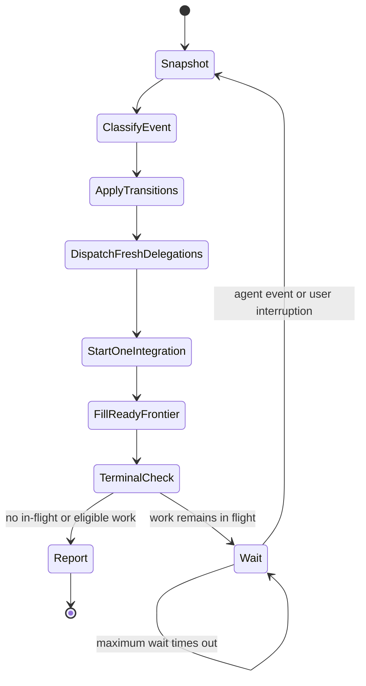

# Orchestration State Machine

This file is the single source of truth for scheduling and transitions. Read it
completely before bootstrap and immediately after every `hub` wait return.

## Cycle inputs

Take a fresh snapshot of all six inputs before deciding what to do:

1. Persisted task-table rows and dependency statuses.
2. Run ledger: task stages, active delegation agents, agent history, outstanding
   delegations, and accepted evidence.
3. `hub` `list` and `jobs` snapshots: active-agent availability and newly
   returned results.
4. The event that ended the wait: agent result, question, blocker, timeout, or
   user interruption.
5. Available concurrency capacity.
6. Durable Git evidence: branches, commits, worktrees, review artifacts, and
   remote phase-branch state.

Never infer a transition from a message alone when the transition requires
durable evidence.

## Orchestrator cycle

Execute every box in order after an event. Do not jump directly from an agent
result to waiting.

### Snapshot

Refresh all cycle inputs. Drain every available agent update so one wake-up
handles the complete current mailbox rather than only its first message.

### Classify event

- Agent result: associate it with exactly one task, active delegation agent, and
  outstanding bounded stage.
- Agent question or blocker: answer only the orchestration decision it requires;
  preserve the task stage.
- Wait timeout: preserve every state and proceed through the rest of the cycle.
- User cancellation: stop the affected agents and report the preserved state.
- Other user interruption: incorporate the instruction or answer, then continue
  the cycle.

### Apply transitions

Accept a claimed result only when the stage's completion criterion and durable
evidence agree. Apply every accepted transition in integer task-ID order. Record
rejected evidence without advancing the task.

### Dispatch fresh delegations

Spawn a new agent for every preparation, repair, review cycle, integration, or
publication made ready by accepted transitions. Never dispatch new bounded work
to an agent already present in the ledger history. Use the active agent only for
a question, blocker, or missing-evidence exchange within its original
delegation.

### Start one integration

When no integration or publication is active, start the lowest-ID task in
`QUEUED_INTEGRATION`. Keep all other approved tasks queued.

### Fill ready frontier

Recompute `READY` tasks from the persisted table. Dispatch preparation for as
many lowest-ID ready tasks as capacity permits in the same scheduling pass.

### Terminal check

- If delegations are in flight, call `hub` with `op: "wait"` and
  `timeoutMs: 3600000` once.
- If work exists but only unmet dependencies block it, report each blocked task
  and dependency.
- If the requested scope is complete, report completion.
- If that wait times out while work remains in flight, call the same `hub` wait
  again. Timeout is not a terminal state.

## Per-task state machine

```mermaid
stateDiagram-v2
    [*] --> BLOCKED: status OPEN; dependency not PASSED
    [*] --> READY: status OPEN; all dependencies PASSED
    [*] --> TASK_REVIEW: status PREPARED

    BLOCKED --> READY: every dependency becomes PASSED
    READY --> PREPARING: developer dispatched
    PREPARING --> PREPARING: evidence incomplete / question / blocker
    PREPARING --> TASK_REVIEW: preparation accepted; PREPARED committed and pushed

    TASK_REVIEW --> TASK_REPAIR: reviewer REJECTED
    TASK_REPAIR --> TASK_REVIEW: developer repair committed
    TASK_REVIEW --> QUEUED_INTEGRATION: reviewer PASSED

    QUEUED_INTEGRATION --> INTEGRATING: integration slot acquired
    INTEGRATING --> INTEGRATING: evidence incomplete / question / blocker
    INTEGRATING --> INTEGRATION_REPAIR: integration checks failed
    INTEGRATING --> INTEGRATION_REVIEW: integration branch and checks ready
    INTEGRATION_REVIEW --> INTEGRATION_REPAIR: reviewer REJECTED
    INTEGRATION_REPAIR --> INTEGRATION_REPAIR: repair checks failed; fresh developer dispatched
    INTEGRATION_REPAIR --> INTEGRATION_REVIEW: developer repair committed and checked
    INTEGRATION_REVIEW --> PUBLISHING: reviewer PASSED

    PUBLISHING --> PUBLISHING: push evidence incomplete / question / blocker
    PUBLISHING --> COMPLETE: merge and PASSED status published; cleanup complete
    COMPLETE --> [*]
```

## Transition table

<!-- markdownlint-disable MD013 -->

| Current state        | Required input                                  | Action                                             | Next state           | Completion criterion                                     |
| -------------------- | ----------------------------------------------- | -------------------------------------------------- | -------------------- | -------------------------------------------------------- |
| `BLOCKED`            | Every dependency is persisted as `PASSED`       | Add to ready frontier                              | `READY`              | No dependency is `OPEN`, `PREPARED`, or merely in flight |
| `READY`              | Developer capacity and clean detached worktree  | Spawn fresh developer for preparation              | `PREPARING`          | Ledger records active agent and stage in agent history    |
| `PREPARING`          | Preparation evidence satisfies `PREPARATION.md` | Persist `PREPARED`; spawn fresh reviewer            | `TASK_REVIEW`        | Status commit and push succeed                           |
| `PREPARING`          | Missing evidence, question, or blocker          | Ask or answer within active delegation              | `PREPARING`          | Original bounded delegation remains active               |
| `TASK_REVIEW`        | Reviewer returns `REJECTED` with findings       | Spawn fresh developer for task repair               | `TASK_REPAIR`        | Repair delegation names the rejected evidence            |
| `TASK_REPAIR`        | Repair commit and verification evidence         | Spawn fresh reviewer for full task review           | `TASK_REVIEW`        | Reviewer receives the complete repaired boundary         |
| `TASK_REVIEW`        | Reviewer returns evidence-backed `PASSED`       | Enqueue by integer ID                               | `QUEUED_INTEGRATION` | Review checklist and validator pass                      |
| `QUEUED_INTEGRATION` | No other integration/publication active         | Spawn fresh developer for integration               | `INTEGRATING`        | Agent history records the integration delegation         |
| `INTEGRATING`        | Complete integration branch and checks          | Spawn fresh reviewer for full integration review    | `INTEGRATION_REVIEW` | Branch remains unpublished and commit is recorded        |
| `INTEGRATING`        | Integration checks fail with complete evidence  | Spawn fresh developer for integration repair        | `INTEGRATION_REPAIR` | Repair delegation names branch, commit, and failed checks |
| `INTEGRATION_REVIEW` | Reviewer returns `REJECTED` with findings       | Spawn fresh developer for integration repair        | `INTEGRATION_REPAIR` | Repair delegation names the reviewed commit and findings |
| `INTEGRATION_REPAIR` | Repair checks fail with complete evidence       | Spawn fresh developer for another repair            | `INTEGRATION_REPAIR` | New delegation names branch, commit, and failed checks    |
| `INTEGRATION_REPAIR` | Repair commit and integration checks            | Spawn fresh reviewer for full integration review    | `INTEGRATION_REVIEW` | Reviewer receives the new integrated commit              |
| `INTEGRATION_REVIEW` | Reviewer returns evidence-backed `PASSED`       | Spawn fresh developer to publish reviewed commit    | `PUBLISHING`         | Reviewed commit identity is recorded in the ledger       |
| `PUBLISHING`         | Fast-forward push succeeds                      | Pull; persist `PASSED`; push status; clean up       | `COMPLETE`           | Remote merge and status commits exist; cleanup succeeds  |

<!-- markdownlint-enable MD013 -->

Any input that does not satisfy its row leaves the task in its current state.
Request only missing bounded evidence from the active agent while its original
delegation remains active.

## Agent assignment decision

For every bounded stage delegation:

1. Confirm the prior delegation is settled and the task has no outstanding
   delegation.
2. Spawn a new agent with `task` and the required agent type.
3. Record its unique agent ID, task, role, and stage in the ledger history.
4. Set it as the active delegation agent until its result is accepted or
   rejected.

Never use `hub` `send` to start another stage, repair attempt, or review cycle.
An idle or parked historical agent is not reusable. `hub` `send` is reserved
for questions, blockers, and missing bounded evidence within the agent's
original active delegation.

## Safety invariants

- `READY` is computed only from persisted `PASSED` dependencies.
- At most one task is in `INTEGRATING`, `INTEGRATION_REVIEW`,
  `INTEGRATION_REPAIR`, or `PUBLISHING`.
- Each task has at most one outstanding delegation.
- Each accepted result comes from the active agent for that exact bounded stage.
- No agent ID is assigned to more than one bounded stage delegation during the
  run.
- The reviewed integration commit is the commit published.
- `COMPLETE` implies every prior gate has accepted evidence.
